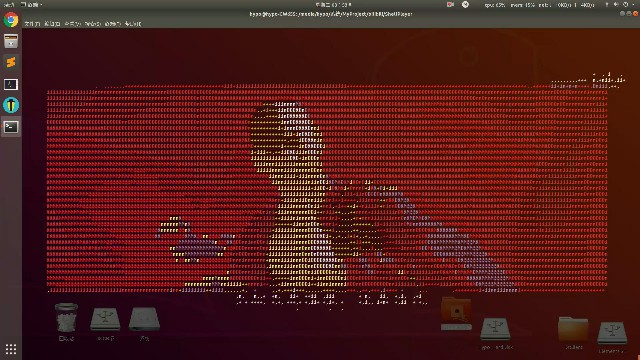
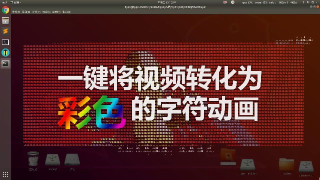
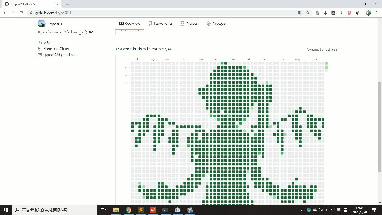
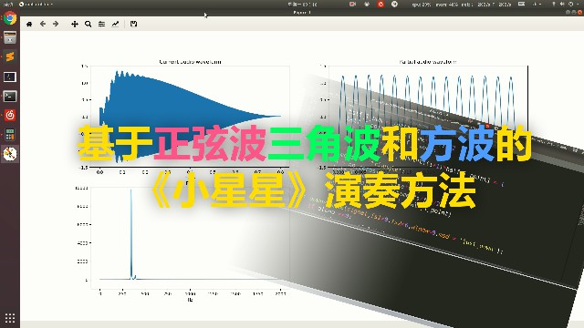

# bilibili
### 代码长大了，会帮up主做视频了 

|                 项目名(单击项目名进入项目页)                 |                 演示(单击图片或文字观看视频)                 |                 教程(单击图片或文字观看视频)                 |
| :----------------------------------------------------------: | :----------------------------------------------------------: | :----------------------------------------------------------: |
| [DeepMosaics](https://github.com/HypoX64/DeepMosaics) 自动对视频/图片去码或打码 |                              /                               |  [一键去除照片和视频中的马赛克——Deepmosaics软件使用教程](https://www.bilibili.com/video/BV1LJ411c7Hg) |
| [Plogo](https://github.com/HypoX64/Plogo) Pornhub 风格的视频模板 |                              /                               |  [教程\]5分钟快速制作一个自己专属的P站片头——模板分享](https://www.bilibili.com/video/BV1gC4y1p7gC) |
| [ShellPlayer](https://github.com/HypoX64/ShellPlayer) 在终端中看视频，色彩斑斓且富有声音的 |  [大威天龙](https://www.bilibili.com/video/BV1dT4y1u76w) [鸡你太美](https://www.bilibili.com/video/BV1Ag4y1z7BB) [黑人抬棺](https://www.bilibili.com/video/BV16V411C7xy) |  [【教程】如何一键将视频转化为彩色的字符动画](https://www.bilibili.com/video/BV18V411r7U1) |
| [OneImage2Video](https://github.com/HypoX64/bilibili/tree/master/OneImage2Video) 用一个或一些图片生成视频 |  [BadApple](https://www.bilibili.com/video/BV1w54y1z72s) [香蕉君](https://www.bilibili.com/video/BV1Vg4y1v7s) |                              /                               |
| [GuiChu](https://github.com/HypoX64/GuiChu) 鬼畜视频生成器 |  [你猫和老鼠X余生一个浪](https://www.bilibili.com/video/BV1c54y1Q7RG) [克 罗 地 亚 灭 蚊 狂 想 曲](https://www.bilibili.com/video/BV1ft4y1X7q6) |                              /                               |
|  [PlayMusic](./PlayMusic/README.md) 根据简谱自动生成音乐  |  [小星星](https://www.bilibili.com/video/BV1Dv411z7H1) |                              /                               |
| [syseye](https://github.com/HypoX64/syseye) 轻量级深度学习服务器性能监视器 |                              /                               |                              /                               |

